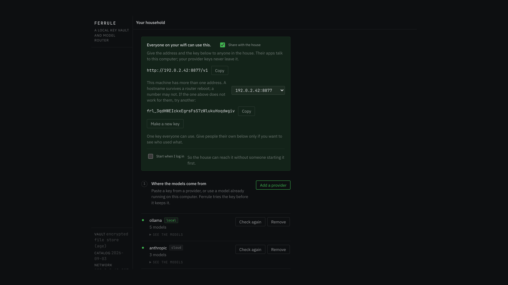

<h1 align="center">Ferrule</h1>

<p align="center">
  <strong>Every LLM key held once, encrypted, on your own machine —<br>
  with one OpenAI-compatible endpoint on top that your whole house can use.</strong>
</p>

<p align="center">
  <a href="../../releases/latest"></a>
  <a href="LICENSE"></a>
  
  
</p>



---

## Get going

**1. Install**

| | |
|---|---|
| **macOS** | Download **[Ferrule-macos.zip](../../releases/latest)**, unzip, drag `Ferrule.app` to Applications, double-click. First open needs right-click → Open (it is not notarised). |
| **Linux** | `curl -fsSL https://raw.githubusercontent.com/NakliTechie/ferrule/main/install.sh \| sh` |
| **Windows** | Download `ferrule-windows-amd64.exe` from the [latest release](../../releases/latest) and run it. |
| **Go** | `go install github.com/NakliTechie/ferrule/cmd/ferrule@latest` |

**2. Start it** — `ferrule serve`, or just open the app. The panel is at
**<http://localhost:8899>**.

**3. Give it something to route.** If Ollama or LM Studio is running, Ferrule has already
found it. Otherwise click **Add a provider** and paste a key — Ferrule probes the endpoint
and fires one real request before it will call the source live.

**4. Point an app at it.** The panel shows an address and a household key. Anything that
speaks OpenAI takes them:

```python
from openai import OpenAI
c = OpenAI(base_url="http://localhost:8899/v1", api_key="frl_…")  # never a provider key
c.chat.completions.create(model="everyday", messages=[...])
```

That is the whole setup. **No config file, no account, no restart.**

> **No keys to hand?** `make demo` stands up a whole Ferrule with fake providers and
> replayed traffic, so you can click around before deciding. Nothing you own is involved.

---

## What it is

Ferrule is a **key vault first, a model router second**. Paste a provider key once and
Ferrule becomes the one encrypted local place it lives. Apps get a Ferrule token instead —
revoke one, the rest keep working. The unified endpoint, the model board, the alias
ladders and the spend and egress views all fall out of the vault.

One static Go binary. No account, no telemetry, no server. Ferrule makes exactly one
request on its own behalf — a background fetch of the public model-capability catalog,
carrying nothing about you, which you can turn off.

*A ferrule is the fitting that binds many strands into a single clean termination.*

### What it does that the alternatives don't

**Probe, don't declare.** Comparable tools ask you to hand-write a config listing models
and endpoints. Ferrule scans localhost for running runtimes and adopts them, and adding a
cloud provider is *paste a key*, not *edit a file*.

**A dead key is never quietly stored.** Adding a source probes, classifies, and fires one
real request before calling it live. If that fails the source is kept, visibly dead, with
the provider's own words and a specific next action — a 402 from DeepSeek means the
account is empty and the key is fine; a 404 from NVIDIA means that one model is outside
your tier and the others may work.

**Egress visibility.** Cost dashboards are everywhere; a data-egress dashboard is not.
Ferrule knows which requests stayed on the machine and which went to a provider, so it
shows *where your prompts went*, not only what they cost. Metadata only — content logging
is off by default and, when on, stays local.

The panel answers in **0.11 s** cold. A routable model takes as long as the runtime takes
to serve one real request — about 5 s for a local model already pulled.

---

## Share it with the house

Sharing is on out of the box, with a switch in the panel. One **household key** works for
everybody from the first start; give people their own with `ferrule key <name>` when you
want the usage list to say who, or to cut one person off without cutting off the house.

**Inference** is served to your network, and only with a valid Ferrule token — no token,
401. **Everything else** — the panel, the vault, minting tokens, the ledger, config
export, `/mcp` — answers only this machine, enforced on the peer address of the accepted
TCP connection rather than a header, so a caller cannot claim to be local. Your provider
keys never cross the network; what does is a token you can revoke.

Turn sharing off and the network gets 403 on the next request, no restart.
`ferrule serve --host 127.0.0.1` closes the port outright and no setting reopens it.

> **One thing to know:** tokens cross your LAN in the clear. On your own wifi that is the
> same trust boundary every other device already sits behind — but a token spends money,
> so mint one per person rather than sharing. For something airtight, run Ferrule on a
> [Tailscale](https://tailscale.com) address instead of your LAN.

**Start it at login** with the switch in the panel, or `ferrule startup on` — a launchd
agent on macOS, a systemd user unit on Linux, a Task Scheduler logon task on Windows.

## Every command

```
ferrule serve                     # the daemon: endpoints + the control panel
ferrule open                      # make sure it is running, then show the panel
ferrule add                       # scan localhost and adopt what is running
ferrule add anthropic             # paste a key (read from the terminal, never from argv)
ferrule ls models --local         # every model on this machine
ferrule refresh anthropic         # re-check a source with the key it already holds
ferrule rm anthropic              # remove a source, its models, and its key
ferrule alias fast <src>/qwen3:8b <src>/llama-3.3-70b   # a ladder, tried in order
ferrule remap gpt-4o fast         # serve a hardcoded id from a model you chose
ferrule key om                    # a token for one person or app, shown once
ferrule usage --egress            # what left the machine
ferrule startup on                # start Ferrule when you log in
ferrule export / import           # a portable encrypted configuration
```

`model` may be an alias, a real id, `source/model`, or an id you have remapped — which is
how you handle an app that will only ever send `gpt-4o`.

## Where your keys live

Encrypted at rest with [age](https://age-encryption.org) in `~/.config/ferrule`. A
plaintext key never touches SQLite, the logs, or the ledger — only an opaque vault
reference does, and a test asserts it.

Two ways to hold the vault open, defending against different things:

- **Identity file** (default) — mode 0600, beside the store; the daemon starts unattended.
  Stops another account on the machine, and the everyday leaks that put keys in a dozen
  `.env` files. Does **not** stop someone who copies the whole directory: a backup takes
  both files, and two files is one decryption.
- **Passphrase** — `serve --passphrase`. Nothing that can open the vault is written to
  disk, so a copy of the directory is useless without you. The daemon cannot then start
  unattended.

Neither stops code already running as you against a live daemon; no local single-user
secret store can, because the daemon has to read the key to make the request. What Ferrule
offers there is the ledger: every use of every key is recorded, so a key used behind your
back is one you can see was used.

## The two lanes

The fault line is **normalization cost**, not text versus media.

- **Raw tokens — one endpoint.** `/v1/chat/completions`, `/v1/completions`,
  `/v1/embeddings`, `/v1/images/generations`. Any chat or embeddings model, local or
  cloud, through one URL.
- **Media — native shape.** Prediction-based providers (Replicate) are reached at
  `/p/<source>/…` with their own request and response shape left byte-identical. Ferrule
  injects the key and logs the egress, and lends the key only to that provider's inference
  routes.

## The agent face

Control operations are published as an MCP manifest at `/mcp`, generated from the same
command bus the panel and the CLI dispatch through — so `manifest ⊇ command bus` holds by
construction, and a test asserts it. Mutating operations **stage** rather than land: the
agent proposes, you apply. A provider key is withheld from the staged payload entirely.
Inference does not go through this face.

## Verify it yourself

```
make check     # gofmt, go vet, and the checkpoint harnesses
make dist      # all five targets, CGO off
```

`make check` refuses a skipped test as well as a failing one — a machine that cannot run a
gate has to say so rather than quietly accept the package. The harnesses are the gates:
the add pipeline reaching `live` for every seed provider and `failed` *with a visible
reason* for a bad key; the OpenAI SDK completing calls to a cloud and a local model with
correct per-token attribution; a 100-request replay reproducing exact per-app, per-model
and per-egress counts; passthrough byte-identity; the MCP face staging its mutations; and
the control plane refusing the network from a real non-loopback bind.

## Status

Verified end to end on macOS and Linux. The Windows login-item registration compiles and
its task arguments are tested, but has not been run on Windows. Nothing is signed or
notarised. Intel Macs are served by the `ferrule-darwin-amd64` binary rather than the app.

## Not doing

No accounts, no auth, no multi-user, no team key pool, no hosted backend. No provider
breadth for its own sake: a curated seed set — Anthropic, DeepSeek, Groq, NVIDIA, OpenAI,
Replicate, and a generic OpenAI-compatible endpoint for everything else — widened when a
real request arrives. No telemetry, ever. And Ferrule does not run models: llama.cpp,
Ollama and the providers do inference; Ferrule routes.

## License

MIT — see [LICENSE](LICENSE). The embedded typefaces (JetBrains Mono, IBM Plex Sans) are
OFL 1.1; see [NOTICE](NOTICE).

Founding document: [FERRULE.md](FERRULE.md) · what shipped: [SPEC.md](SPEC.md) · for a
coding agent: [llms.txt](llms.txt)
